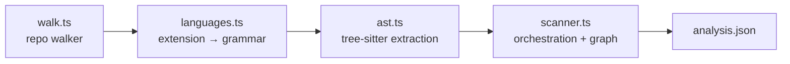

# Scanner

The scanner (`src/scan/`) produces the evidence base the agent plans from. It is fully deterministic — tree-sitter grammars compiled to WebAssembly, no native builds, no network.

## Pipeline

### `walk.ts` — file walker

`walkRepo` (`src/scan/walk.ts:59`) recursively lists files with a built-in ignore set (`node_modules`, `target`, `.git`, …), a lightweight `.gitignore` parser (`parseGitignore`, `src/scan/walk.ts:11` — glob → regex, supports `*`/`**`/`?`/negation/dir-only patterns), and a 1.5 MB size cap. Also reused by the staleness hasher, so "tracked file" means the same thing everywhere.

### `languages.ts` — grammar configs

Each `LanguageSpec` maps a grammar wasm + extensions to:

- `symbolTypes`: AST node type → symbol kind (e.g. Go `function_declaration` → `function`)
- `importTypes` + `importSource`: how to pull the imported module string out of an import node
- `isExported`: language-specific public-surface test (Go: capitalized name; TS/JS: `export` ancestor; Python: no `_` prefix; Rust: `pub` modifier)
- `custom`: hooks for shapes the table can't express — Go `type_spec` (struct vs interface), Rust `impl` blocks, JS `const f = () => {}`

Supported: TypeScript/TSX/JavaScript, Python, Go, Rust, Java, Ruby, C#, PHP, C/C++ (via the C++ grammar).

### `ast.ts` — extraction

`extractFile` (`src/scan/ast.ts`) parses one file and walks the tree once, emitting for each symbol: kind, name, line range, `exported`, a **signature** (source up to the body node, whitespace-collapsed), a **doc line** (preceding comment or Python docstring, first line only), and enclosing container (`parent`) for methods. Grammar wasms come from `@vscode/tree-sitter-wasm` — chosen because its builds match the modern `web-tree-sitter` runtime ABI (the older `tree-sitter-wasms` package was built with tree-sitter-cli 0.20 and fails dylink loading on runtime 0.26).

### `scanner.ts` — orchestration and the import graph

`scanRepo` (`src/scan/scanner.ts:45`) runs the pipeline per file, then resolves imports into **internal dependency edges**:

- relative paths (`./x`) with extension/index guessing — `resolveImport` (`src/scan/scanner.ts:12`)
- Python dotted modules — `resolveDotted` (`src/scan/scanner.ts:25`)
- Go package paths matched against repo directories (directory-level edges) — `resolveGoImport` (`src/scan/scanner.ts:32`)

Unresolved imports are kept and marked `external`. `summarize` (`src/scan/scanner.ts:126`) prints the digest the skill tells the agent to read first: language totals, largest areas with public-symbol counts, and the most-depended-on files.

## Known limits

- Import resolution is heuristic (no tsconfig path aliases, no Rust `mod` resolution, no Java package mapping). Edges are for orientation, not build-system truth.
- Signatures are text slices, not type-checked; grammar parse failures degrade to "file with zero symbols" rather than aborting the scan.

## Sources

- `src/scan/`
