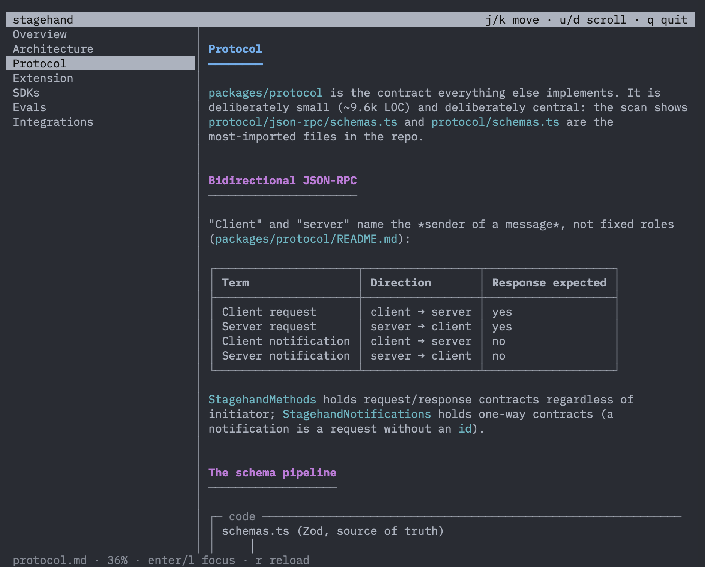

# local-deepwiki

[](https://www.npmjs.com/package/local-deepwiki)
[](LICENSE)
[](package.json)

local-deepwiki generates and maintains a DeepWiki-style knowledge base for a repository, using the coding agent you already run (Claude Code, Cursor, and similar) as the authoring engine. It performs no LLM API calls of its own. The toolkit consists of a tree-sitter AST scanner, a content-hash staleness tracker, a terminal browser, and a skill.

The wiki itself is plain markdown in a `.deepwiki/` directory — versioned, reviewable in pull requests, and readable without any server.

<p align="center">
  
  <br>
  <em>`deepwiki tui` browsing an agent-generated wiki for <a href="https://github.com/browserbase/stagehand">Stagehand</a></em>
</p>

```console
$ deepwiki status
✗ stale        enforcement                  enforcement.md
✓ fresh        architecture                 architecture.md
✓ fresh        ledger                       ledger.md

1 page(s) need attention. Ask your coding agent to update them.
```

## How it works

1. **Scan.** `deepwiki scan` parses the repository with tree-sitter (WebAssembly grammars, no native compilation) and produces `analysis.json`: symbols with signatures and doc comments, public API surface per module, and an internal import graph.
2. **Generate.** Your coding agent, following the bundled skill, reads the analysis, reads the key source files it identifies, and writes the wiki: a page tree adapted to the repository, with file-and-line references and a source manifest per page.
3. **Track.** Each page records the source files it documents and a content hash over them. `deepwiki status` compares those hashes against the working tree and reports precisely which pages have drifted, so subsequent updates touch only what changed.
4. **Browse.** `deepwiki tui` renders the wiki in the terminal. Questions about the codebase go to your agent, which uses the wiki as an index and verifies against current code before answering.

```
┌──────────────┐   deepwiki scan    ┌────────────┐
│ coding agent │ ◄───────────────── │ repository │
│ (yours)      │    AST analysis    └────────────┘
└──────┬───────┘
       │ writes .deepwiki/*.md + wiki.json
       ▼
  deepwiki tui / deepwiki status
```

## Getting started

```console
$ cd your-repo
$ npx local-deepwiki init
```

This installs the skill into `.claude/skills/local-deepwiki/` and creates `.deepwiki/`. Then, in your coding agent:

> generate the deepwiki for this repo

When it finishes:

```console
$ npx local-deepwiki tui
```

After the code changes, ask the agent to *update the deepwiki* — `deepwiki status` gives it the exact list of stale pages.

## Commands

| Command | Description |
| --- | --- |
| `deepwiki scan [path]` | AST-parse the repository and write `.deepwiki/analysis.json`, printing a summary of the largest areas, public symbols, and most-depended-on files |
| `deepwiki status [--json] [--update]` | Compare each page's recorded source hashes against the working tree. `--update` re-seals hashes after regeneration. Exits 2 when pages are stale, for use in CI |
| `deepwiki tui [path]` | Browse the wiki in the terminal (`j`/`k` navigate, `d`/`u` scroll, `q` quit). Prints the page tree when output is piped |
| `deepwiki tree [path]` | Print the page tree with staleness markers |
| `deepwiki init [path]` | Install the agent skill and create `.deepwiki/` |

## The `.deepwiki/` format

```
.deepwiki/
  wiki.json        # page tree: { id, title, file, sources[], sourcesHash, children[] }
  overview.md      # pages: plain markdown
  architecture.md
  ...
  analysis.json    # scanner output (gitignored; regenerated at will)
```

`wiki.json` and the pages are intended to be committed. The format is deliberately minimal: any tool that writes it can feed the viewer, and any agent that reads it can answer from it.

## Supported languages

Symbol extraction covers TypeScript, TSX, JavaScript, Python, Go, Rust, Java, Ruby, C#, PHP, and C/C++, via [`@vscode/tree-sitter-wasm`](https://www.npmjs.com/package/@vscode/tree-sitter-wasm). Files in other languages are still tracked for staleness; they simply contribute no symbols to the analysis.

## Why local-deepwiki?

- **No API keys, no separate LLM pipeline.** Comparable tools embed provider configuration, prompt orchestration, and response caching to drive their own generation loop. Here, generation is delegated to an agent that already has code-reading tools and full repository context, so the package ships only what must be deterministic (parsing, hashing) or rendered (the TUI).
- **Adaptive structure.** The page tree is planned from AST evidence per repository, rather than filling in a fixed template.
- **Verifiable output.** Every page cites the files it was derived from; every claim is checkable. Hash tracking keeps the documentation's freshness observable rather than assumed.
- **Incremental by design.** Updates are scoped to pages whose sources actually changed.

## Why not local-deepwiki?

- It requires a coding agent. There is no standalone generation mode, by design.
- Wiki quality depends on the agent following the skill; the toolkit constrains and verifies, but does not itself write prose.
- There is no hosted web UI or built-in Q&A chat. Questions are answered by your agent, which can verify against the code — a deliberate trade-off, but a different workflow than hosted DeepWiki services.

## License

[MIT](LICENSE)
